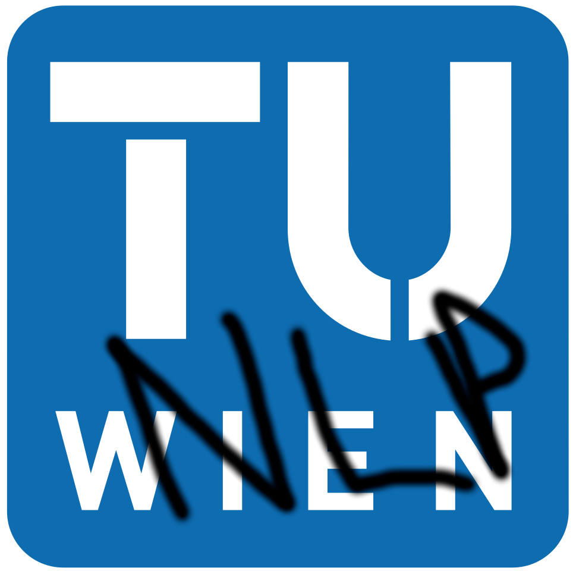

<p align="center">
    <h1>Natural Language Processing and Information Extraction 2023WS - Project</h1>
  
</p>

# About this template
This template was provided as part of the Natural Language Processing and Information Extraction course during the 2023W semester at TU Wien.

# Scope of the project
The aim of this project is to analyse the task of Relation Extraction (RE), meaning that given a sentence, the entities should be identified, and then a relationship is assigned between them. The focus is on the second part of the task, i.e. correctly classifying the relations using both classical machine learning (ML) and Deep Learning (DL) methods. The TACRED[1] dataset and its revisited version TACREV[2] are considered for the task.

For a quick outline of the project, please refer to the [summary report](https://github.com/tuw-nlp-ie/project-nlpizza/blob/main/NLP_Summary.pdf) or to the [presentation slides](https://github.com/tuw-nlp-ie/project-nlpizza/blob/main/NLPizza.pptx).

# Running the code
Ensure that python 3.10 is available as it is used for the execution of the code.

## Milestone 1
The code and the report for Milestone 1 can be found [here](/docs/milestone1/). For this milestone an exploration of the dataset was performed, along with a first attempt at the task using hand-crafted regular expressions.

## Milestone 2
The code and the report for Milestone 2 can be found [here](/docs/milestone2/).\
The code is split into two, with one examining classical machine learning models, while the other uses Deep Learning techniques.

## Final submission
For this final submission, the Random Forest model along with the Positional-Aware LSTM by Zhang et al.[1] are considered.
### Final submission - PA_LSTM
The code for the PA-LSTM model can be found [here](https://github.com/tuw-nlp-ie/project-nlpizza/tree/main/docs/final_submission/PA-LSTM), along with a README with additional details. This part of the project was done by Maria Pronestì and Samuele D'Avenia.

Before running the code for the PA-LSTM model, please download the needed data available at the following [link](https://tuwienacat-my.sharepoint.com/personal/e12302519_student_tuwien_ac_at/_layouts/15/onedrive.aspx?e=5%3Ab95c866836834dd490a48b1e5d8356df&fromShare=true&at=9&CT=1698067565188&OR=OWA%2DNT&CID=7ea7167a%2D682d%2Dfa11%2D09d4%2Dea644b7fd06b&FolderCTID=0x012000880506A6CC4D50439E75EF0A873B79EF&id=%2Fpersonal%2Fe12302519%5Fstudent%5Ftuwien%5Fac%5Fat%2FDocuments%2FNLP%2FShared) and place them as follows:
- `best_model_*.pt`: This files must be put in the [saved_model](https://github.com/tuw-nlp-ie/project-nlpizza/tree/main/docs/final_submission/PA-LSTM/saved_models/00) folder.
- `embedding.npy`: This file contains word embeddings obtained using pre-trained GloVe vectors and must be placed in the [main folder](https://github.com/tuw-nlp-ie/project-nlpizza/tree/main/docs/final_submission/PA-LSTM).
### Final submission - RF
The code for the RF model can be found [here](https://github.com/tuw-nlp-ie/project-nlpizza/tree/main/docs/final_submission/RF). This part of the project was done by Silvia Bonomi and Andrea Nugara.

Before running the notebooks RF_Tacrev and RF_Tacred, it is important to download the file "cc.en.300_reduced.bin" from the following [link](https://tuwienacat-my.sharepoint.com/:f:/r/personal/e12302519_student_tuwien_ac_at/Documents/NLP/Shared?csf=1&web=1&e=cRG8yN) folder and save it in the [same directory as the notebook](https://github.com/tuw-nlp-ie/project-nlpizza/tree/main/docs/final_submission/RF).


## The directory structure and the architecture of the project

```
📦project-NLPizza-2023
 ┣ NLP_Summary.txt
 ┣ NLPizza.pptyx
 ┣ 📂data
 ┃ ┣ 📂tacred
 ┃ ┃ ┣ 📂conll
 ┃ ┃ ┃ ┣ 📜 dev.conll
 ┃ ┃ ┃ ┣ 📜 test.conll
 ┃ ┃ ┃ ┗ 📜 train.conll
 ┃ ┃ ┣ 📂json
 ┃ ┃ ┃ ┣ 📜 dev.json
 ┃ ┃ ┃ ┣ 📜 test.json
 ┃ ┃ ┃ ┗ 📜 train.json
 ┃ ┣ 📂tacrev
 ┃ ┃ ┣ 📂conll
 ┃ ┃ ┃ ┣ 📜 dev.conll
 ┃ ┃ ┃ ┗ 📜 test.conll
 ┃ ┃ ┣ 📂json
 ┃ ┃ ┃ ┣ 📜 dev.json
 ┃ ┃ ┃ ┗ 📜 test.json
 ┃ ┗ 📜README.md
 ┣ 📂docs
 ┃ ┣ 📂milestone1
 ┃ ┃ ┣ 📜 milestone1.ipynb
 ┃ ┃ ┗ 📜 milestone1_report.pdf
 ┃ ┣ 📂milestone2
 ┃ ┃ ┣ 📂best_models_DL
 ┃ ┃ ┃ ┣ 📜 DL1.pt
 ┃ ┃ ┃ ┣ ...
 ┃ ┃ ┃ ┗ 📜 LSTM1_Drop10.pt
 ┃ ┃ ┣ 📜 milestone2_report.pdf
 ┃ ┃ ┣ 📜 milestone2_DL.ipynb
 ┃ ┃ ┣ 📜 running_functions_DL.py
 ┃ ┃ ┣ 📜 utilities_DL.py
 ┃ ┃ ┗ 📜 milestone2_RF.ipynb
 ┃ ┣ 📂final_submission
 ┃ ┃ ┣ 📂PA-LSTM
 ┃ ┃ ┃ ┣ 📜pa_lstm_train_eval.ipynb
 ┃ ┃ ┃ ┣ 📜relation_agnostic_error_analysis.ipynb
 ┃ ┃ ┃ ┣ 📜relation_specific_error_analysis.ipynb
 ┃ ┃ ┃ ┣ 📜pa_lstm_train_eval.ipynb
 ┃ ┃ ┃ ┣ 📜RF_summary_data.csv
 ┃ ┃ ┃ ┣ 📂evaluation
 ┃ ┃ ┃ ┃ ┣ 📜errors_TACRED_model.txt
 ┃ ┃ ┃ ┃ ┣ 📜errors_TACREV_model.txt
 ┃ ┃ ┃ ┣ 📂load_data
 ┃ ┃ ┃ ┃ ┣ ...
 ┃ ┃ ┃ ┣ 📂model
 ┃ ┃ ┃ ┃ ┣ ...
 ┃ ┃ ┃ ┣ 📂saved_models/00
 ┃ ┃ ┃ ┃ ┣ ...
 ┃ ┃ ┃ ┣ 📂utils
 ┃ ┃ ┃ ┃ ┣ scorer.py
 ┃ ┃ ┃ ┃ ┣ ... 
 ┃ ┃ ┣ 📂RF
 ┃ ┃ ┃ ┣ 📂UtilsRF
 ┃ ┃ ┃ ┃ ┣ 📜scorer.py
 ┃ ┃ ┃ ┣ 📜predictions_tacred.txt
 ┃ ┃ ┃ ┣ 📜predictions_tacrev.txt
 ┃ ┃ ┃ ┣ 📜RF_Tacred.ipynb
 ┃ ┃ ┃ ┣ 📜RF_Tacrev.ipynb
 ┣ 📂images
 ┃ ┗ 📜tuw_nlp.png
 ┣ 📜.gitignore
 ┣ 📜LICENSE
 ┣ 📜README.md
 ┣ 📜setup.py
```

- `data`: This folder contains data taken from TACRED and TACREV datasets in two different formats. This will be used for training and testing the models.
- `docs`: This folder contains the code and reports for the different milestones and the final submission.
  - `milestone1`: This folder contains the code and report for milestone 1
  - `milestone2`: This folder contains the code and report for milestone 2
  - `final_submission`: This folder contains the code and report for the final submission.
    - `RF`: This folder contains the code and report for the RF model for the final submission along with the corresponding error analysis.
    - `PA-LSTM`: This folder contains the code and report for the RF model for the final submission along with the corresponding error analysis..
- `LICENSE`: This file contains the license of this repository.
- `team.cfg`: This file contains the information about your team.


## References
[1] Yuhao Zhang, Victor Zhong, Danqi Chen, Gabor Angeli, and Christopher D. Manning. Position-aware attention and supervised data improve slot filling. In Proceedings of the 2017 Conference on Empirical Methods in Natural Language Processing, pages 35–45, Copenhagen, Denmark, September 2017. Association for Computational Linguistics. doi: 10.18653/v1/D17-1004. URL https://aclanthology.org/D17-1004/

[2] Christoph Alt, Aleksandra Gabryszak, and Leonhard Hennig. TACRED revisited: A thorough evaluation of the TACRED relation extraction task. In Proceedings of the 58th Annual Meeting of the Association for Computational Linguistics, pages 1558–1569, Online, July 2020. Association for Computational Linguistics. doi: 10.18653/v1/2020.acl-main.142. URL https://aclanthology.org/2020.acl-main.142/
